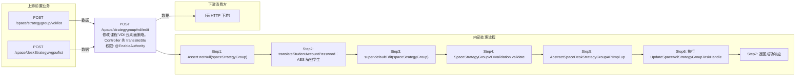

# POST /space/strategygroup/vdi/edit

> 修改课程 VDI 云桌面策略。Controller 先 translateStudentAccountPassword 解密学生端密码；defaultEdit 走 SpaceStrategyGroupVDIValidation.validateBeforeUpdate：执行 validateBeforeCreate（名称查重 62100317/62100220、规格校验 62100331/62100332、VGPU 校验），校验旧策略状态 AVAILABLE(62100320)，通过 SPI 校验无桌面运行(62100303)，validStrategyChange 校验桌面类型(62100319)/策略类型(62100318)不可修改、系统盘不得缩小(62100309)，并校验关联镜像的 vGPU 兼容；随后 AbstractSpaceDeskStrategyGroupAPIImpl.update 维护旧数据并转换平台策略组，执行 UpdateSpaceVdiStrategyGroupTaskHandle（更新平台策略组→更新本地+失效缓存）。 ｜ @EnableAuthority ｜ 异步任务流：更新平台策略组 → 更新本地策略+失效缓存（前端密码先解密）

## 依赖关系全景图

## 接口基本信息

| 项目 | 内容 |
|---|---|
| URL | /space/strategygroup/vdi/edit |
| Controller | SpaceDeskStrategyGroupVDIController |
| 方法名 | edit |
| 权限注解 | @EnableAuthority |
| 执行方式 | 异步任务流：更新平台策略组 → 更新本地策略+失效缓存（前端密码先解密） |
| 业务含义 | 修改课程 VDI 云桌面策略。Controller 先 translateStudentAccountPassword 解密学生端密码；defaultEdit 走 SpaceStrategyGroupVDIValidation.validateBeforeUpdate：执行 validateBeforeCreate（名称查重 62100317/62100220、规格校验 62100331/62100332、VGPU 校验），校验旧策略状态 AVAILABLE(62100320)，通过 SPI 校验无桌面运行(62100303)，validStrategyChange 校验桌面类型(62100319)/策略类型(62100318)不可修改、系统盘不得缩小(62100309)，并校验关联镜像的 vGPU 兼容；随后 AbstractSpaceDeskStrategyGroupAPIImpl.update 维护旧数据并转换平台策略组，执行 UpdateSpaceVdiStrategyGroupTaskHandle（更新平台策略组→更新本地+失效缓存）。 |

## 入参详情

### SpaceDeskStrategyGroupVDI（继承 AbstractSpaceDeskStrategyGroup）

| 参数名 | 类型 | 必填 | 约束 | 说明 |
|---|---|---|---|---|
| id | UUID | 是 | 必填 | 待修改策略 id |
| name | String | 是 | 非空、≤32 | 策略名称（可修改，需查重） |
| pattern | CbbCloudDeskPattern | 是 | @NotNull，不可修改 | 桌面类型 |
| strategyType | DeskVirtualizationType | 是 | 不可修改 | 策略类型 |
| systemSize | Integer | 是 | @NotNull @Range(0,2048)，只可扩大 | 系统盘大小 |
| cpu | Integer | 是 | @Range(1,64) | CPU 核数 |
| memory | Integer | 否 | @Range(1024,262144) | 内存 MB |
| deskCreateMode | DeskCreateMode | 否 | @Nullable | 创建方式 |
| platformStrategyGroup | PlatformStrategyGroup | 是 | @NotNull | 平台策略组（更新时回填） |
| enableInternet | Boolean | 是 | @NotNull | 联网 |
| 其余策略项 | mixed | 否 | 同 create | enableHyperVisorImprove/enableNested/enableDoubleScreen/enableHa/haPriority/desktopOccupyDriveArr/keyboardEmulationType 等 |
| studentAccountPreName | String | 否 |  | 学生端账号密码（密码前端传密文，服务端解密）（studentAccountPre |
| vgpuExtraInfo | String | 否 |  | vGPU 配置（修改需校验关联镜像兼容）（vgpuExtraInfo） |
| studentAccountPassword | String | 否 |  | 学生端账号密码（密码前端传密文，服务端解密）（studentAccountPas |
| deskPersonalConfigStrategyType | String | 否 |  | 浮动个性配置（deskPersonalConfigStrategyType） |
| vgpuType | String | 否 |  | vGPU 配置（修改需校验关联镜像兼容）（vgpuType） |
| enablePersonalConfig | Boolean | 否 |  | 浮动个性配置（enablePersonalConfig） |
| enableStudentAccount | Boolean | 否 |  | 学生端账号密码（密码前端传密文，服务端解密）（enableStudentAcco |
| personalConfigDiskSize | Integer | 否 |  | 浮动个性配置（personalConfigDiskSize） |## 出参详情

| 返回类型 | DefaultWebResponse |
|---|---|

| 字段 | 类型 | 说明 |
|---|---|---|
| content | null | 修改成功返回空 content |

## 上游前置业务

### 前置1：POST /space/strategygroup/vdi/list

VDI课程策略ID，来源为策略列表（由 field_map 契约映射）

### 前置2：POST /space/deskStrategy/vgpu/list

VGPU类型，来源为 vgpu/list（由 field_map 契约映射）
## 内部处理流程

### 批量处理器：UpdateSpaceVdiStrategyGroupTaskHandle（StateTaskHandle，同步状态机）

| 步骤 | 说明 |
|---|---|
| 1 | UpdatePlatformStrategyGroupProcessor：platformStrategyGroupAPI.update 更新平台策略组（失败不 undo） |
| 2 | UpdateLocalStrategyGroupProcessor：repository.update 更新本地主数据并失效缓存 |

### 处理流程

1. Assert.notNull(spaceStrategyGroup)
2. translateStudentAccountPassword：AES 解密学生密码，长度>16 Assert.state 失败
3. super.defaultEdit(spaceStrategyGroup)
4. SpaceStrategyGroupVDIValidation.validateBeforeUpdate：先 validateBeforeCreate（名称查重 62100317/62100220、规格 62100331/62100332、VGPU 62100322/62100323）；再 findById 校验旧策略存在与状态 AVAILABLE(62100320)；validDesktopRunning（SPI，运行中 62100303）；validStrategyChange（pattern 62100319/strategyType 62100318/systemSize 62100309）；关联镜像时 validDesktopImageSupportGpu
5. AbstractSpaceDeskStrategyGroupAPIImpl.update：findById 取旧策略维护旧数据；convertPlatformStrategyGroup 回填平台策略组
6. 执行 UpdateSpaceVdiStrategyGroupTaskHandle：a) UpdatePlatformStrategyGroupProcessor（平台更新，无 undo）b) UpdateLocalStrategyGroupProcessor（本地更新 + invalidateCache）
7. 返回成功响应

## 下游消费方

（本接口数据主要被自身/关联接口消费，或经 SPI 通知）

> 📖 错误码/状态码对照表见 **code_map_all.md**（工程级全量）与 **error_code_map_tci_strategy.md**（TCI 接口级，含触发条件）。

## 接口参数约束分析

| 层级 | 参数 | 规则 | 失败结果 |
|---|---|---|---|
| AUTH | 接口 | @EnableAuthority 需操作权限 | 无权限 401/403 |
| BUSINESS | state | 旧策略必须 AVAILABLE | 62100320 RCDC_CLOUDDESKTOP_RCC_STRATEGY_NOT_AVAILABLE |
| BUSINESS | 桌面运行 | 策略下有运行桌面不可修改 | 62100303 RCDC_RCC_DESKTOP_STRATEGY_ENVIRONMENT_DESKTOP_RUNNING |
| BUSINESS | pattern | 桌面类型不可修改 | 62100319 RCDC_RCC_CLOUDDESKTOP_DESK_PATTERN_CAN_NOT_UPDATE |
| BUSINESS | strategyType | 策略类型不可修改 | 62100318 RCDC_RCC_CLOUDDESKTOP_RCC_STRATEGY_TYPE_CAN_NOT_UPDATE |
| BUSINESS | systemSize | 系统盘不得缩小 | 62100309 RCDC_RCC_DESKTOP_STRATEGY_SYSTEM_DISK_LESS_BEFORE |
| BUSINESS | vgpu | 关联镜像需支持新 vGPU 配置 | 62100322/62100323 |

## 参数取值策略

| 参数 | 策略 | 说明 |
|---|---|---|
| id | user_input/from_query | 按业务构造 |
| name | user_input/from_query | 按业务构造 |
| pattern | user_input/from_query | 按业务构造 |
| strategyType | user_input/from_query | 按业务构造 |
| systemSize | user_input/from_query | 按业务构造 |
| cpu | user_input/from_query | 按业务构造 |
| memory | user_input/from_query | 按业务构造 |
| vgpuType/vgpuExtraInfo | user_input/from_query | 按业务构造 |
| deskCreateMode | user_input/from_query | 按业务构造 |
| enableStudentAccount/studentAccountPreName/studentAccountPassword | user_input/from_query | 按业务构造 |
| platformStrategyGroup | user_input/from_query | 按业务构造 |
| enableInternet | user_input/from_query | 按业务构造 |
| enablePersonalConfig/deskPersonalConfigStrategyType/personalConfigDiskSize | user_input/from_query | 按业务构造 |
| 其余策略项 | user_input/from_query | 按业务构造 |

## 成功/失败断言基准

### 成功场景

| 场景 | 断言点 |
|---|---|
| 入参合法且无运行桌面 | $.status==SUCCESS |
| 修改名称且未重复 | $.status==SUCCESS |

### 失败场景

| 场景 | 触发条件 | 断言点 |
|---|---|---|
| 修改桌面类型 | pattern 由还原改个性 | $.status==ERROR 且 $.msgKey==62100319 |
| 系统盘缩小 | 100G→60G | $.status==ERROR 且 $.msgKey==62100309 |
| 策略下有运行桌面 | 桌面运行中 | $.status==ERROR 且 $.msgKey==62100303 |

## 环境清理机制

| 接口 | 说明 |
|---|---|
| 无 | 更新状态机不实现 undo（平台与本地无耦合，失败由乐观锁/重试处理） |

## 前置状态和幂等性标注

| 维度 | 结论 |
|---|---|
| 幂等性 | MEDIUM |
| 说明 | 依赖乐观锁 version，重复提交相同数据版本冲突失败；相同内容重复提交结果一致 |
