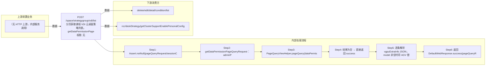

# POST /space/strategygroup/vdi/list

> 分页获取课程 VDI 云桌面策略列表。getDataPermissionPageQueryRequest 追加数据权限过滤（非全权限管理员按 deskStrategyId ∈ 授权策略过滤），PageQueryViewHelper 基于 @PageQueryDTOConfig(dmql="v_rcc_vdi_lesson_strategy.dmql") 查询视图（主表 t_space_vdi_lesson_strategy + 子查询 t_rcc_classroom_image 统计 classroom_used_count）；对每条 vgpuExtraInfo JSON 解析后将 model 中的 AGV 替换为 VgpuType.GPU_AGV 的标题文本再回写返回。 ｜ 无特殊权限 ｜ 同步分页：DMQL 视图分页查询 VDI 课程策略列表（数据权限过滤 + AGV 模型名替换）

## 依赖关系全景图

## 接口基本信息

| 项目 | 内容 |
|---|---|
| URL | /space/strategygroup/vdi/list |
| Controller | SpaceDeskStrategyGroupVDIController |
| 方法名 | pageQuery |
| 权限注解 | 无 |
| 执行方式 | 同步分页：DMQL 视图分页查询 VDI 课程策略列表（数据权限过滤 + AGV 模型名替换） |
| 业务含义 | 分页获取课程 VDI 云桌面策略列表。getDataPermissionPageQueryRequest 追加数据权限过滤（非全权限管理员按 deskStrategyId ∈ 授权策略过滤），PageQueryViewHelper 基于 @PageQueryDTOConfig(dmql="v_rcc_vdi_lesson_strategy.dmql") 查询视图（主表 t_space_vdi_lesson_strategy + 子查询 t_rcc_classroom_image 统计 classroom_used_count）；对每条 vgpuExtraInfo JSON 解析后将 model 中的 AGV 替换为 VgpuType.GPU_AGV 的标题文本再回写返回。 |

## 入参详情

### PageQueryRequest（框架类）

| 参数名 | 类型 | 必填 | 约束 | 说明 |
|---|---|---|---|---|
| page | Integer | 是 | 分页页码（0 基） | pageQueryRequest.getPage() |
| limit | Integer | 是 | 每页条数上限 | pageQueryRequest.getLimit() |
| matchArr | Match[] | 否 | 精确匹配条件 | 框架 DMQL 视图过滤条件 |
| sortArr | Sort[] | 否 | 排序条件 | 框架透传 |

## 出参详情

| 返回类型 | DefaultWebResponse<PageQueryResponse<ViewRccDeskStrategyDTO>> |
|---|---|

| 字段 | 类型 | 说明 |
|---|---|---|
| itemArr | ViewRccDeskStrategyDTO[] | 策略列表（元素字段见下） |
| total | long | 总条数 |
| id | UUID | 课程策略ID |
| strategyName | String | 策略名称 |
| desktopType | CbbCloudDeskPattern | 桌面类型 |
| systemDisk | Integer | 系统盘大小（GB） |
| cpu | Integer | CPU核数 |
| memory | Integer | 内存大小（MB） |
| canUsed | Boolean | 是否可用（state!='AVAILABLE' 为 false） |
| canUsedMessage | String | 不可用提示（本接口不填充，condition/list 使用） |
| deskCreateMode | DeskCreateMode | 创建方式 |
| deskStrategyState | CbbDeskStrategyState | 策略状态 |
| strategyType | CbbStrategyType | 策略类型 |
| classroomUsedCount | Integer | 引用策略的教室数 |
| vgpuType | VgpuType | vGPU类型 |
| vgpuExtraInfo | String | vGPU附加信息JSON（AGV→GPU_AGV 标题替换后回写） |
| enablePersonalConfig | Boolean | 是否启用浮动个性 |
| creatorUserName | String | 创建者 |
| createTime | Date | 创建时间 |
| version | Integer | 版本号 |
| deskStrategyId | UUID | 云桌面策略组ID（数据权限过滤字段） |

## 上游前置业务

> 本接口上游为服务端内部调用（非 HTTP 端点）：
> - 
## 内部处理流程

### 处理流程

1. Assert.notNull(pageQueryRequest/sessionContext)
2. getDataPermissionPageQueryRequest：adminPermissionHelper.addPermissionFileter 追加数据权限过滤（PERMISSION_TYPE_STRATEGY_GROUP）
3. PageQueryViewHelper.pageQuery(dataPermissionPageQueryRequest, ViewRccDeskStrategyDTO.class) 查询视图
4. 结果为空 → 直接返回 success
5. 逐条解析 vgpuExtraInfo JSON，model 非空时将 AGV 替换为 GPU_AGV.getTitle() 并回写
6. 返回 DefaultWebResponse.success(pageQueryResponse)

## 下游消费方

### 消费1：POST /space/strategygroup/vdi/list

VDI课程策略ID，被 delete/edit/detail/condition/list、getClusterSupportEnablePersonalConfig 消费（由 field_map 契约映射）
## 接口参数约束分析

| 层级 | 参数 | 规则 | 失败结果 |
|---|---|---|---|
| DATA_PERMISSION | deskStrategyId | 非全权限管理员仅返回授权策略 | 未授权策略被过滤（不报错） |

## 参数取值策略

| 参数 | 策略 | 说明 |
|---|---|---|
| page | user_input/from_query | 按业务构造 |
| limit | user_input/from_query | 按业务构造 |
| matchArr | user_input/from_query | 按业务构造 |
| sortArr | user_input/from_query | 按业务构造 |

## 成功/失败断言基准

### 成功场景

| 场景 | 断言点 |
|---|---|
| 存在策略数据 | $.content.itemArr 非空 |
| 策略含 AGV vGPU | $.content.itemArr 非空 且 vgpuExtraInfo.model 中 AGV 替换为 GPU_AGV |

### 失败场景

| 场景 | 触发条件 | 断言点 |
|---|---|---|
| pageQueryRequest 为 null | 请求体缺失 | $.status==ERROR |

## 环境清理机制

| 接口 | 说明 |
|---|---|
| 无 | 只读查询接口 |

## 前置状态和幂等性标注

| 维度 | 结论 |
|---|---|
| 幂等性 | HIGH |
| 说明 | 只读分页查询，无副作用 |
