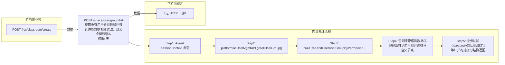

# POST /space/user/group/list

> 获取所有用户分组数据并按管理员数据权限过滤、封装成树形结构 ｜ 无特殊权限 ｜ sync

## 依赖关系全景图

## 接口基本信息

| 项目 | 内容 |
|---|---|
| URL | /space/user/group/list |
| Controller | SpaceUserController |
| 方法名 | listUserGroupWidthTree |
| 权限注解 | 无 |
| 执行方式 | sync |
| 业务含义 | 获取所有用户分组数据并按管理员数据权限过滤、封装成树形结构 |

## 入参详情

### ListUserGroupWebRequest

| 参数名 | 类型 | 必填 | 约束 | 说明 |
|---|---|---|---|---|
| enableFilterDefaultGroup | Boolean | 否 | @Nullable 可空 | 是否过滤默认未分组 |
| enableFilterAdGroup | Boolean | 否 | @Nullable 可空 | 是否过滤AD域用户组 |
| enableFilterLdapGroup | Boolean | 否 | @Nullable 可空 | 是否过滤LDAP域用户组 |
| enableFilterThirdPartyGroup | Boolean | 否 | @Nullable 可空 | 是否过滤第三方用户组 |
| filterGroupId | UUID | 否 | @Nullable 可空 | 指定过滤掉的用户组ID |
| noPermission | Boolean | 否 | @Nullable 可空 | 是否无需校验权限（全量返回） |
| classroomId | UUID | 否 | @Nullable 可空 | 教室池ID |
| enableFilterPoolUserGroup | Boolean | 否 | @Nullable 可空 | 是否过滤池用户分组 |
| enableCountGroupUser | Boolean | 否 | @Nullable 可空 | 是否统计分组用户数 |

## 出参详情

| 返回类型 | DefaultWebResponse（content.itemArr=UserGroupVO[]） |
|---|---|

| 字段 | 类型 | 说明 |
|---|---|---|
| itemArr | UserGroupVO[] | 用户组树节点列表（含权限标记与 children） |
| itemArr[].id | String | 用户组ID（继承 TreeNodeVO） |
| itemArr[].parentId | String | 父用户组ID（继承 TreeNodeVO） |
| itemArr[].label | String | 用户组名称（继承 TreeNodeVO） |
| itemArr[].children | List<TreeNodeVO> | 子用户组节点（继承 TreeNodeVO） |
| itemArr[].allowDelete | Boolean | 是否允许删除 |
| itemArr[].enableAd | Boolean | 是否启用AD域 |
| itemArr[].enableLdap | Boolean | 是否启用LDAP |
| itemArr[].enableDefault | Boolean | 是否为默认组 |
| itemArr[].enableThirdParty | Boolean | 是否启用第三方 |
| itemArr[].disabled | Boolean | 是否禁用 |
| itemArr[].totalUserNum | Integer | 组内用户总数 |
| itemArr[].isAssigned | Boolean | 是否已分配 |
| itemArr[].assignedUserNum | Integer | 已分配用户数 |
| itemArr[].disableUserNum | Integer | 禁用用户数 |
| itemArr[].bindDiskNum | Integer | 绑定磁盘数 |
| itemArr[].accountExpireDate | Long | 账户过期时间戳 |
| itemArr[].invalidTime | Integer | 失效时长 |
| itemArr[].bindDesktopNum | Integer | 绑定桌面数 |
| itemArr[].bindHostNum | Integer | 绑定主机数 |
| （说明） |  | TreeNodeVO 其余通用软件分组字段（groupId/groupName/description/digitalSign/installPath/productName/processName/originalFileName/fileCustomMd5 及对应 Flag、directoryFlag/topLevelFile）在用户组树场景下不填充，通常为 null，未逐行列出 |
## 上游前置业务

### 前置1：POST /rcc/classroom/create

用户组归属教室过滤参数（可空），推断（由 field_map 契约映射）
## 内部处理流程

### 处理流程

1. Assert sessionContext 非空
2. platformIacUserMgmtAPI.getAllUserGroup() 取全部用户组；空则返回空响应
3. buildTreeAndFilterUserGroupByPermission：noPermission=true 或管理员全组权限 → 全量可见(disabled=false)
4. 否则按管理员数据权限过滤可见用户组并递归补全父节点
5. 业务过滤（AD/LDAP/默认组/指定组等）并构建树形结构返回

## 下游消费方

### 消费1：POST /space/user/group/list

用户组ID（树形节点 id），被 /rcc/space/user/update selectedGroupIdList 消费（由 field_map 契约映射）
## 接口参数约束分析

| 层级 | 参数 | 规则 | 失败结果 |
|---|---|---|---|
| request | sessionContext | 非空 | webmvc 校验异常 |

## 参数取值策略

| 参数 | 策略 | 说明 |
|---|---|---|
| enableFilterDefaultGroup | user_input/from_query | 按业务构造 |
| enableFilterAdGroup | user_input/from_query | 按业务构造 |
| enableFilterLdapGroup | user_input/from_query | 按业务构造 |
| enableFilterThirdPartyGroup | user_input/from_query | 按业务构造 |
| filterGroupId | user_input/from_query | 按业务构造 |
| noPermission | user_input/from_query | 按业务构造 |
| classroomId | user_input/from_query | 按业务构造 |
| enableFilterPoolUserGroup | user_input/from_query | 按业务构造 |
| enableCountGroupUser | user_input/from_query | 按业务构造 |

## 成功/失败断言基准

### 成功场景

| 场景 | 断言点 |
|---|---|
| 无用户组 | $.status==SUCCESS 且 $.content.itemArr 为空 |
| 有用户组且有权限 | $.content.itemArr 非空 |

### 失败场景

| 场景 | 触发条件 | 断言点 |
|---|---|---|
| 权限不足 | 无授权 | 403 |

## 环境清理机制

| 接口 | 说明 |
|---|---|
| 本接口创建的资源 | 通过对应 delete 接口清理 |

## 前置状态和幂等性标注

| 维度 | 结论 |
|---|---|
| 幂等性 | high |
| 说明 | 纯查询接口 |
