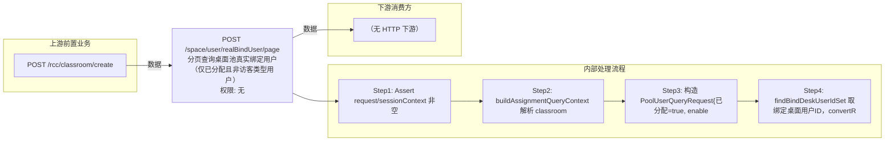

# POST /space/user/realBindUser/page

> 分页查询桌面池真实绑定用户（仅已分配且非访客类型用户） ｜ 无特殊权限 ｜ sync

## 依赖关系全景图

## 接口基本信息

| 项目 | 内容 |
|---|---|
| URL | /space/user/realBindUser/page |
| Controller | SpaceUserController |
| 方法名 | pageRealBindUser |
| 权限注解 | 无 |
| 执行方式 | sync |
| 业务含义 | 分页查询桌面池真实绑定用户（仅已分配且非访客类型用户） |

## 入参详情

### PageQueryRequest

| 参数名 | 类型 | 必填 | 约束 | 说明 |
|---|---|---|---|---|
| page | Integer | 是 | pagekit 分页参数 | 页码 |
| limit | Integer | 是 | pagekit 分页参数 | 每页条数 |
| matchArr | Match[] | 是 | 需含 classroomId 匹配条件 | 查询条件 |

## 出参详情

| 返回类型 | CommonWebResponse<DefaultPageResponse<UserListDTO>> |
|---|---|

| 字段 | 类型 | 说明 |
|---|---|---|
| itemArr | UserListDTO[] | 真实绑定用户列表 |
| total | Long | 总数 |
| itemArr[].id | UUID | 用户ID |
| itemArr[].hostId | UUID | 主机ID |
| itemArr[].userRole | String | 用户角色 |
| itemArr[].userType | IacUserTypeEnum | 用户类型 |
| itemArr[].realName | String | 真实姓名 |
| itemArr[].userDescription | String | 用户描述 |
| itemArr[].userName | String | 用户名 |
| itemArr[].phoneNum | String | 手机号 |
| itemArr[].groupId | UUID | 用户组ID |
| itemArr[].groupName | String | 用户组名称 |
| itemArr[].groupNameArr | String[] | 用户组名称数组 |
| itemArr[].userState | IacUserStateEnum | 用户状态 |
| itemArr[].createTime | Date | 创建时间 |
| itemArr[].email | String | 邮箱 |
| itemArr[].desktopNum | Integer | 绑定云桌面数量 |
| itemArr[].canDelete | Boolean | 是否可删除 |
| itemArr[].hasRecycleBin | Boolean | 回收站是否有桌面 |
| itemArr[].lock | Boolean | 是否锁定 |
| itemArr[].lockTime | Date | 锁定时间 |
| itemArr[].unlockTime | Date | 解锁时间 |
| itemArr[].openOtpCertification | Boolean | 是否开启动态口令认证 |
| itemArr[].hasBindOtp | Boolean | 是否绑定动态口令 |
| itemArr[].openCasCertification | Boolean | 是否开启外部CAS认证 |
| itemArr[].openAccountPasswordCertification | Boolean | 是否开启账号密码认证 |
| itemArr[].openHardwareCertification | Boolean | 是否开启硬件特征码 |
| itemArr[].openSmsCertification | Boolean | 是否开启短信认证 |
| itemArr[].openThirdPartyCertification | Boolean | 是否开启第三方认证 |
| itemArr[].accountExpireDateStr | String | 账户过期时间（字符串） |
| itemArr[].enableDomainSync | Boolean | 是否开启域同步 |
| itemArr[].isAssigned | Boolean | 是否已分配 |
| itemArr[].hasBindDisk | Boolean | 是否绑定磁盘 |
| itemArr[].disabled | Boolean | 是否禁用 |
| itemArr[].invalidTime | Integer | 失效时长 |
| itemArr[].isInvalid | Boolean | 是否失效 |
| itemArr[].invalidDescription | String | 失效描述 |
| itemArr[].accountExpireDate | String | 账户过期时间 |
| itemArr[].openRadiusCertification | Boolean | 是否开启RADIUS认证 |
| itemArr[].vdi1License | Integer | 是否占用VDI1授权（1/0） |
| itemArr[].vdi1LicenseDuration | CbbLicenseDurationEnum | VDI1授权持续类型 |
| itemArr[].vgpuLicense | Integer | 是否占用3D设计授权（1/0） |
| itemArr[].vgpuLicenseDuration | CbbLicenseDurationEnum | 3D设计授权持续类型 |
| itemArr[].hasBindPoolDesktop | Boolean | 是否绑定桌面池中的桌面 |
| itemArr[].hasBindAppHost | Boolean | 是否绑定静态应用主机 |
| itemArr[].openWorkWeixinCertification | Boolean | 是否开启企业微信认证 |
| itemArr[].openFeishuCertification | Boolean | 是否开启飞书认证 |
| itemArr[].openDingdingCertification | Boolean | 是否开启钉钉认证 |
| itemArr[].openOauth2Certification | Boolean | 是否开启OAuth2认证 |
| itemArr[].openPluginCertification | Boolean | 是否开启插件认证 |
| itemArr[].openRjclientCertification | Boolean | 是否开启锐捷客户端扫码 |
| itemArr[].groupPath | String | 用户组路径 |
| itemArr[].enableCustomPasswordPolicy | Boolean | 是否开启自定义密码有效期 |
| itemArr[].thirdPartyUserDisableType | ThirdPartyUserDisableType | 第三方用户禁用类型 |
| itemArr[].hasVdi1License | Boolean | 是否占用VDI1授权 |
| itemArr[].hasVgpuLicense | Boolean | 是否占用3D设计授权 |
| itemArr[].workRole | IacWorkRole | 用户工作角色 |
## 上游前置业务

### 前置1：POST /rcc/classroom/create

教室ID（通过 exact match 字段 classroomId 传入），来源为教室创建返回（由 field_map 契约映射）
## 内部处理流程

### 处理流程

1. Assert request/sessionContext 非空
2. buildAssignmentQueryContext 解析 classroomId 与权限；无权限返回空成功
3. 构造 PoolUserQueryRequest{已分配=true, enableUseRType=true, 非访客类型枚举} 调 pageQueryPoolUser
4. findBindDeskUserIdSet 取绑定桌面用户ID，convertRealBindUserList 转换并返回

## 下游消费方

### 消费1：POST /space/user/realBindUser/page

真实绑定用户ID列表（由 field_map 契约映射）
## 接口参数约束分析

| 层级 | 参数 | 规则 | 失败结果 |
|---|---|---|---|
| request | request | 非空且需含 classroomId 匹配条件 | 缺少classroomId时 Assert 失败 |

## 参数取值策略

| 参数 | 策略 | 说明 |
|---|---|---|
| page | user_input/from_query | 按业务构造 |
| limit | user_input/from_query | 按业务构造 |
| matchArr | user_input/from_query | 按业务构造 |

## 成功/失败断言基准

### 成功场景

| 场景 | 断言点 |
|---|---|
| 无权限 | $.status==SUCCESS 且 $.content.itemArr 为空 |
| 有已分配用户 | $.content.itemArr 非空 |

### 失败场景

| 场景 | 触发条件 | 断言点 |
|---|---|---|
| 权限不足 | 无授权 | 403 |

## 环境清理机制

| 接口 | 说明 |
|---|---|
| 本接口创建的资源 | 通过对应 delete 接口清理 |

## 前置状态和幂等性标注

| 维度 | 结论 |
|---|---|
| 幂等性 | high |
| 说明 | 纯查询接口 |
