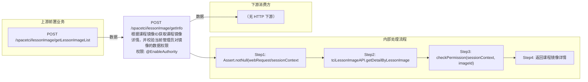

# POST /spacetci/lessonImage/getInfo

> 根据课程镜像ID获取课程镜像详情，并校验当前管理员对镜像的数据权限 ｜ @EnableAuthority ｜ sync

## 依赖关系全景图

## 接口基本信息

| 项目 | 内容 |
|---|---|
| URL | /spacetci/lessonImage/getInfo |
| Controller | TCILessonImageController |
| 方法名 | getLessonImage |
| 权限注解 | @EnableAuthority |
| 执行方式 | sync |
| 业务含义 | 根据课程镜像ID获取课程镜像详情，并校验当前管理员对镜像的数据权限 |

## 入参详情

### IdWebRequest

| 参数名 | 类型 | 必填 | 约束 | 说明 |
|---|---|---|---|---|
| id | UUID | 是 | @NotNull，课程镜像ID | 课程镜像主键ID（TCILessonImageDTO.id） |

## 出参详情

| 返回类型 | DefaultWebResponse<TCILessonImageDetailDTO> |
|---|---|

| 字段 | 类型 | 说明 |
|---|---|---|
| imageId | UUID | 镜像模板ID |
| imageName | String | 镜像名称 |
| cbbImageType | CbbImageType | 镜像类型（仅TCI） |
| systemDisk | Integer | 系统盘大小(GB) |
| diskSize | Integer | 数据盘大小(GB) |
| osType | CbbOsType | 操作系统类型 |
| guestToolVersion | String | GT版本 |
| cbbCloudDeskPattern | CbbCloudDeskPattern | 云桌面类型 |
| strategyName | String | 课程策略名称 |
| hide | Boolean | 是否隐藏 |
| createTime | Date | 创建时间 |
| lastModifyTime | Date | 更新时间 |

## 上游前置业务

### 前置1：POST /spacetci/lessonImage/getLessonImageList

课程镜像ID（IdWebRequest=lessonImageId），来源为课程镜像列表（由 field_map 契约映射）
## 内部处理流程

### 处理流程

1. Assert.notNull(webRequest/sessionContext) 校验入参
2. tciLessonImageAPI.getDetailByLessonImageId(id) 查询课程镜像详情
3. checkPermission(sessionContext, imageId)：非全量权限管理员需拥有该镜像权限，否则返回spacetci_lessonimage_permission_denied
4. 返回课程镜像详情

## 下游消费方

### 消费1：POST /spacetci/lessonImage/getInfo

课程镜像模板ID（由 field_map 契约映射）

> 📖 错误码/状态码对照表见 **code_map_all.md**（工程级全量）与 **error_code_map_tci_strategy.md**（TCI 接口级，含触发条件）。

## 接口参数约束分析

| 层级 | 参数 | 规则 | 失败结果 |
|---|---|---|---|
| auth | admin | 非全量权限管理员需拥有imageId权限 | spacetci_lessonimage_permission_denied |
| data | id | 课程镜像必须存在 | 62110021 SPACETCI_LESSONIMAGE_CANNOT_FIND_LESSON_IMAGE |

## 参数取值策略

| 参数 | 策略 | 说明 |
|---|---|---|
| id | user_input/from_query | 按业务构造 |

## 成功/失败断言基准

### 成功场景

| 场景 | 断言点 |
|---|---|
| 管理员有镜像权限且记录存在 | $.status==SUCCESS && $.content.imageId 非空（Builder.success(TCILessonImageDetailDTO)） |

### 失败场景

| 场景 | 触发条件 | 断言点 |
|---|---|---|
| 无镜像数据权限 | checkPermission返回false | $.status==ERROR && $.msgKey==spacetci_lessonimage_permission_denied |
| 课程镜像不存在 | getDetailByLessonImageId抛62110021 | $.status==ERROR && $.msgKey==62110021 |

## 环境清理机制

| 接口 | 说明 |
|---|---|
| 本接口创建的资源 | 通过对应 delete 接口清理 |

## 前置状态和幂等性标注

| 维度 | 结论 |
|---|---|
| 幂等性 | readonly |
| 说明 | 纯查询接口 |
