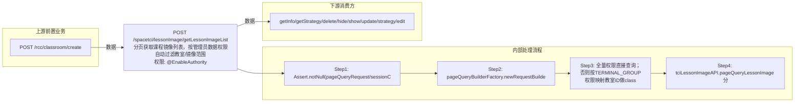

# POST /spacetci/lessonImage/getLessonImageList

> 分页获取课程镜像列表，按管理员数据权限自动过滤教室/镜像范围 ｜ @EnableAuthority ｜ sync

## 依赖关系全景图

## 接口基本信息

| 项目 | 内容 |
|---|---|
| URL | /spacetci/lessonImage/getLessonImageList |
| Controller | TCILessonImageController |
| 方法名 | getLessonImageList |
| 权限注解 | @EnableAuthority |
| 执行方式 | sync |
| 业务含义 | 分页获取课程镜像列表，按管理员数据权限自动过滤教室/镜像范围 |

## 入参详情

### PageQueryRequest

| 参数名 | 类型 | 必填 | 约束 | 说明 |
|---|---|---|---|---|
| rows | Integer | 否 | 分页行数 | 每页条数 |
| page | Integer | 否 | 分页页码 | 当前页 |
| condition | Object | 否 |  | 排序与过滤条件（condition） |
| sort | Object | 否 |  | 排序与过滤条件（sort） |## 出参详情

| 返回类型 | DefaultWebResponse<PageQueryResponse<TCIViewLessonImageDTO>> |
|---|---|

| 字段 | 类型 | 说明 |
|---|---|---|
| itemArr[] | TCIViewLessonImageDTO[] | 课程镜像分页列表 |
| id | UUID | 课程镜像ID |
| classroomId | UUID | 教室ID |
| classroomName | String | 教室名称 |
| imageId | UUID | 镜像模板ID |
| imageName | String | 镜像名称 |
| teacherImage | Boolean | 是否教师机镜像 |
| hide | Boolean | 是否隐藏 |
| lessonStrategyId | UUID | 课程策略ID |
| strategyName | String | 策略名称 |
| total | Long | 总条数 |

## 上游前置业务

### 前置1：POST /rcc/classroom/create

教室ID筛选（可空）（由 field_map 契约映射）
## 内部处理流程

### 处理流程

1. Assert.notNull(pageQueryRequest/sessionContext) 校验入参
2. pageQueryBuilderFactory.newRequestBuilder(pageQueryRequest) 构造分页请求
3. 全量权限直接查询；否则按TERMINAL_GROUP权限映射教室ID做classroomId in过滤，按IMAGE权限做imageId in过滤
4. tciLessonImageAPI.pageQueryLessonImage 分页查询并返回

## 下游消费方

### 消费1：POST /spacetci/lessonImage/getLessonImageList

课程镜像ID，被 getInfo/getStrategy/delete/hide/show/update/strategy/edit 消费（由 field_map 契约映射）
## 接口参数约束分析

| 层级 | 参数 | 规则 | 失败结果 |
|---|---|---|---|
| data | admin | 非全量权限自动追加教室与镜像权限过滤 | 无权限数据自动不可见 |

## 参数取值策略

| 参数 | 策略 | 说明 |
|---|---|---|
| rows | user_input/from_query | 按业务构造 |
| page | user_input/from_query | 按业务构造 |
| sort/condition | user_input/from_query | 按业务构造 |

## 成功/失败断言基准

### 成功场景

| 场景 | 断言点 |
|---|---|
| 任意权限管理员查询 | $.status==SUCCESS && $.content.itemArr 非空（PageQueryResponse 分页框架字段为 itemArr/total） |

### 失败场景

| 场景 | 触发条件 | 断言点 |
|---|---|---|
| 分页参数为空 | pageQueryRequest为null | $.status==ERROR（Assert 参数校验，无固定 msgKey） |

## 环境清理机制

| 接口 | 说明 |
|---|---|
| 本接口创建的资源 | 通过对应 delete 接口清理 |

## 前置状态和幂等性标注

| 维度 | 结论 |
|---|---|
| 幂等性 | readonly |
| 说明 | 纯查询接口 |
