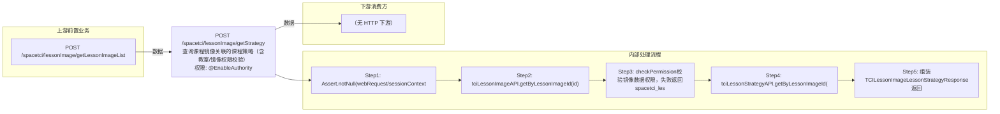

# POST /spacetci/lessonImage/getStrategy

> 查询课程镜像关联的课程策略（含教室/镜像权限校验） ｜ @EnableAuthority ｜ sync

## 依赖关系全景图

## 接口基本信息

| 项目 | 内容 |
|---|---|
| URL | /spacetci/lessonImage/getStrategy |
| Controller | TCILessonImageController |
| 方法名 | getStrategy |
| 权限注解 | @EnableAuthority |
| 执行方式 | sync |
| 业务含义 | 查询课程镜像关联的课程策略（含教室/镜像权限校验） |

## 入参详情

### IdWebRequest

| 参数名 | 类型 | 必填 | 约束 | 说明 |
|---|---|---|---|---|
| id | UUID | 是 | @NotNull，课程镜像ID | 课程镜像主键ID |

## 出参详情

| 返回类型 | DefaultWebResponse<TCILessonImageLessonStrategyResponse> |
|---|---|

| 字段 | 类型 | 说明 |
|---|---|---|
| imageId | UUID | 镜像模板ID |
| imageName | String | 镜像名称 |
| tciLessonsStrategyDTO | SpaceDeskStrategyGroupTCI | 关联的课程策略对象（含继承字段，见下） |
| tciLessonsStrategyDTO.id | UUID | 策略组ID（继承 AbstractDomainObject） |
| tciLessonsStrategyDTO.name | String | 策略组名称（继承 AbstractDomainObject） |
| tciLessonsStrategyDTO.note | String | 备注（继承 AbstractSpaceDeskStrategyGroup） |
| tciLessonsStrategyDTO.state | SpaceStrategyGroupState | 策略状态（AVAILABLE 等） |
| tciLessonsStrategyDTO.pattern | CbbCloudDeskPattern | 桌面类型（RECOVERABLE/PERSONAL） |
| tciLessonsStrategyDTO.strategyType | DeskVirtualizationType | 策略类型（TCI/VOI） |
| tciLessonsStrategyDTO.enablePersonalConfig | Boolean | 是否开启个人配置 |
| tciLessonsStrategyDTO.deskPersonalConfigStrategyType | CbbDeskPersonalConfigStrategyType | 个人配置策略类型 |
| tciLessonsStrategyDTO.personalConfigDiskSize | Integer | 个人配置盘大小 |
| tciLessonsStrategyDTO.systemSize | Integer | 系统盘大小 |
| tciLessonsStrategyDTO.desktopOccupyDriveArr | String[] | 第三方盘符 I~Z |
| tciLessonsStrategyDTO.enableInternet | Boolean | 联网开关 |
| tciLessonsStrategyDTO.platformStrategyGroup | PlatformStrategyGroup | 平台策略组 |
| tciLessonsStrategyDTO.enableDiskConfig | Boolean | 是否开启数据盘（自身字段） |
| tciLessonsStrategyDTO.diskSize | Integer | 数据盘大小 GB |
| tciLessonsStrategyDTO.enableScheduleStrategy | Boolean | 是否开启定时还原策略 |
| tciLessonsStrategyDTO.diskRestoreStrategyArr | TCIDiskStrategyDTO[] | 磁盘还原策略数组 |
| tciLessonsStrategyDTO.enableAutoEdit | Boolean | 启用自动编辑（默认 false） |
| tciLessonsStrategyDTO.enableForceAutoEdit | Boolean | 强制自动编辑（默认 true） |
| tciLessonsStrategyDTO.enableAdaptiveResolution | Boolean | 自适应分辨率（默认 true） |

## 上游前置业务

### 前置1：POST /spacetci/lessonImage/getLessonImageList

课程镜像ID（IdWebRequest=lessonImageId），来源为课程镜像列表（由 field_map 契约映射）
## 内部处理流程

### 处理流程

1. Assert.notNull(webRequest/sessionContext) 校验入参
2. tciLessonImageAPI.getByLessonImageId(id) 查询课程镜像
3. checkPermission校验镜像数据权限，失败返回spacetci_lessonimage_permission_denied
4. tciLessonStrategyAPI.getByLessonImageId(id) 查询关联策略，getImageByImageId取镜像名
5. 组装TCILessonImageLessonStrategyResponse返回

## 下游消费方

### 消费1：POST /spacetci/lessonImage/getStrategy

课程镜像模板ID（由 field_map 契约映射）

> 📖 错误码/状态码对照表见 **code_map_all.md**（工程级全量）与 **error_code_map_tci_strategy.md**（TCI 接口级，含触发条件）。

## 接口参数约束分析

| 层级 | 参数 | 规则 | 失败结果 |
|---|---|---|---|
| auth | admin | 需拥有镜像数据权限 | spacetci_lessonimage_permission_denied |
| data | id | 课程镜像必须存在 | 62110021 |

## 参数取值策略

| 参数 | 策略 | 说明 |
|---|---|---|
| id | user_input/from_query | 按业务构造 |

## 成功/失败断言基准

### 成功场景

| 场景 | 断言点 |
|---|---|
| 有权限且课程镜像存在 | $.status==SUCCESS && $.content.imageId 非空 && $.content.imageName 非空（Builder.success(TCILessonImageLessonStrategyResponse)） |

### 失败场景

| 场景 | 触发条件 | 断言点 |
|---|---|---|
| 无镜像权限 | checkPermission失败 | $.status==ERROR && $.msgKey==spacetci_lessonimage_permission_denied |

## 环境清理机制

| 接口 | 说明 |
|---|---|
| 本接口创建的资源 | 通过对应 delete 接口清理 |

## 前置状态和幂等性标注

| 维度 | 结论 |
|---|---|
| 幂等性 | readonly |
| 说明 | 纯查询接口 |
