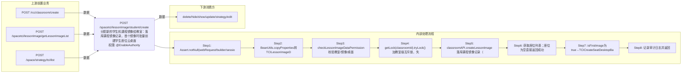

# POST /spacetci/lessonImage/student/create

> 分配新的学生机课程镜像给教室：落库课程镜像记录，首个镜像时批量创建学生座位云桌面，否则推送镜像列表到座位 ｜ @EnableAuthority ｜ async

## 依赖关系全景图

## 接口基本信息

| 项目 | 内容 |
|---|---|
| URL | /spacetci/lessonImage/student/create |
| Controller | TCILessonImageController |
| 方法名 | assignStudentImage |
| 权限注解 | @EnableAuthority |
| 执行方式 | async |
| 业务含义 | 分配新的学生机课程镜像给教室：落库课程镜像记录，首个镜像时批量创建学生座位云桌面，否则推送镜像列表到座位 |

## 入参详情

### TCIAssignImageWebRequest

| 参数名 | 类型 | 必填 | 约束 | 说明 |
|---|---|---|---|---|
| classroomId | UUID | 是 | @NotNull，教室ID | 目标教室 |
| imageId | UUID | 是 | @NotNull，镜像模板ID，需已发布且为TCI类型 | 分配的镜像模板 |
| hide | Boolean | 是 | @NotNull，是否隐藏 | 初始隐藏状态 |
| lessonStrategyId | UUID | 是 | @NotNull，课程策略ID | 关联的课程策略 |

## 出参详情

| 返回类型 | DefaultWebResponse（成功消息key或BatchTaskSubmitResult） |
|---|---|

| 字段 | 类型 | 说明 |
|---|---|---|
| msgKey | String | spacetci_lessonimage_assign_student_image_success_log（座位为空/非首镜像时） |
| taskId | UUID | 首镜像时返回创建云桌面批处理任务ID（BatchTaskSubmitResult） |

## 上游前置业务

### 前置1：POST /rcc/classroom/create

教室ID，来源为教室创建返回（由 field_map 契约映射）

### 前置2：POST /spacetci/lessonImage/getLessonImageList

TCI课程镜像模板ID，来源为课程镜像列表（或 /rcc/deskStrategy/getClassroomImageList）（由 field_map 契约映射）

### 前置3：POST /space/strategy/tci/list

TCI课程策略ID，来源为策略列表（由 field_map 契约映射）
## 内部处理流程

### 批量处理器：TCICreateSeatDesktopBatchTaskHandler(AbstractBatchTaskHandler) 或 PushImageListBatchTaskHandler(AbstractBatchTaskHandler)

| 步骤 | 说明 |
|---|---|
| 1 | TCICreateSeatDesktopBatchTaskHandler.processItem：seatAPI.createTCIDesktop(dto,seatId)逐座位创建云桌面，失败记录审计日志返回FAILURE |
| 2 | PushImageListBatchTaskHandler.processItem：seatAPI.pushClassroomImageList2Seat(seatId)逐座位推送镜像列表 |
| 3 | onFinish：seatAPI.refreshDeskInfo(classroomId)刷新桌面信息，按成功/失败数量返回SUCCESS/FAILURE/PARTIAL_SUCCESS |

### 处理流程

1. Assert.notNull(webRequest/builder/sessionContext) 校验入参
2. BeanUtils.copyProperties转TCILessonImageDTO并setTeacherImage=false
3. checkLessonImageDataPermission校验教室/镜像/桌面策略数据权限，失败返回spacetci_lessonimage_permission_denied
4. getLock(classroomId).tryLock() 加教室级互斥锁，失败返回spacetci_lessonimage_operate_running
5. classroomAPI.createLessonImage 落库课程镜像记录（重复/磁盘超限等校验62110021-62110028）
6. 获取座位列表；座位为空直接返回成功
7. isFirstImage为true→TCICreateSeatDesktopBatchTaskHandler批量创建座位云桌面（异步）；否则dealBatchPushImageList推送镜像列表（异步）
8. 记录审计日志并返回

## 下游消费方

### 消费1：POST /spacetci/lessonImage/student/create

分配产出学生课程镜像ID（经 getLessonImageList 查询），被 delete/hide/show/update/strategy/edit 消费（由 field_map 契约映射）

> 📖 错误码/状态码对照表见 **code_map_all.md**（工程级全量）与 **error_code_map_tci_strategy.md**（TCI 接口级，含触发条件）。

## 接口参数约束分析

| 层级 | 参数 | 规则 | 失败结果 |
|---|---|---|---|
| data | admin | 需拥有教室/镜像/桌面策略数据权限 | spacetci_lessonimage_permission_denied |
| concurrency | classroomId | 同一教室操作互斥 | spacetci_lessonimage_operate_running |
| business | imageId | 镜像必须存在且为TCI类型 | 62110021/62110022 |
| business | imageId | 仅允许已发布镜像 | 62110023 SPACETCI_LESSONIMAGE_IMAGE_STATE_NOT_AVAILABLE |
| business | lessonStrategyId | 镜像系统盘不得大于策略配置 | 62110024 SPACETCI_LESSONIMAGE_SYSTEM_DISK_BIG_LESSONSTRTEGY |
| business | lessonStrategyId | 数据盘配置需一致 | 62110025 SPACETCI_LESSONIMAGE_DATA_DISK_STATE_NOT_SAME |
| business | lessonStrategyId | 数据盘不得大于策略配置 | 62110026 SPACETCI_LESSONIMAGE_DATA_DISK_BIG_LESSONSTRTEGY |
| business | imageId | 同一教室镜像不可重复添加 | 62110027 SPACETCI_LESSONIMAGE_ADD_REPEAT / 62110028 SPACETCI_LESSONIMAGE_ALREADY_EXIST_LESSON_IMAGE |

## 参数取值策略

| 参数 | 策略 | 说明 |
|---|---|---|
| classroomId | user_input/from_query | 按业务构造 |
| imageId | user_input/from_query | 按业务构造 |
| hide | user_input/from_query | 按业务构造 |
| lessonStrategyId | user_input/from_query | 按业务构造 |

## 成功/失败断言基准

### 成功场景

| 场景 | 断言点 |
|---|---|
| 教室无座位 | $.status==SUCCESS（content 为空，msgKey==spacetci_lessonimage_assign_student_image_success_log） |
| 首个镜像且有座位 | $.status==SUCCESS && $.content.taskId 非空（Builder.success(BatchTaskSubmitResult)）；轮询 content.taskId 至终态 batchTaskItemStatus∈["SUCCESS"] |
| 非首镜像 | $.status==SUCCESS（content 为空，msgKey==spacetci_lessonimage_assign_student_image_success_log） |

### 失败场景

| 场景 | 触发条件 | 断言点 |
|---|---|---|
| 数据权限不足 | checkLessonImageDataPermission抛异常 | $.status==ERROR && $.msgKey==spacetci_lessonimage_permission_denied |
| 教室操作进行中 | tryLock失败 | $.status==ERROR && $.msgKey==spacetci_lessonimage_operate_running |
| 重复分配同一镜像 | createLessonImage抛62110027 | $.status==ERROR && $.msgKey==spacetci_lessonimage_assign_student_image_fail_log |

## 环境清理机制

| 接口 | 说明 |
|---|---|
| POST /spacetci/lessonImage/student/delete | 清理本接口分配的课程镜像（学生课程镜像删除接口） |

## 前置状态和幂等性标注

| 维度 | 结论 |
|---|---|
| 幂等性 | low |
| 说明 | 重复分配同一镜像被62110027拦截；不同镜像重复调用会新增记录，非幂等 |
