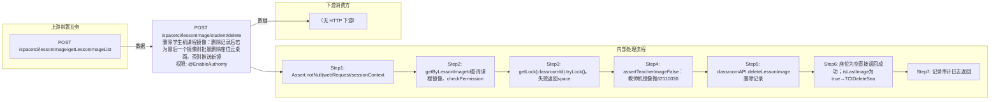

# POST /spacetci/lessonImage/student/delete

> 删除学生机课程镜像：删除记录后若为最后一个镜像则批量删除座位云桌面，否则推送新镜像列表到座位 ｜ @EnableAuthority ｜ async

## 依赖关系全景图

## 接口基本信息

| 项目 | 内容 |
|---|---|
| URL | /spacetci/lessonImage/student/delete |
| Controller | TCILessonImageController |
| 方法名 | deleteStudentLessonImage |
| 权限注解 | @EnableAuthority |
| 执行方式 | async |
| 业务含义 | 删除学生机课程镜像：删除记录后若为最后一个镜像则批量删除座位云桌面，否则推送新镜像列表到座位 |

## 入参详情

### IdWebRequest

| 参数名 | 类型 | 必填 | 约束 | 说明 |
|---|---|---|---|---|
| id | UUID | 是 | @NotNull，课程镜像ID | 要删除的课程镜像记录ID |

## 出参详情

| 返回类型 | DefaultWebResponse（成功消息key或BatchTaskSubmitResult） |
|---|---|

| 字段 | 类型 | 说明 |
|---|---|---|
| msgKey | String | spacetci_lessonimage_delete_student_image_success_log（座位为空/非最后镜像） |
| taskId | UUID | 最后镜像时返回删除云桌面批处理任务ID |

## 上游前置业务

### 前置1：POST /spacetci/lessonImage/getLessonImageList

学生课程镜像ID（IdWebRequest=lessonImageId），来源为课程镜像列表（由 field_map 契约映射）
## 内部处理流程

### 批量处理器：TCIDeleteSeatDesktopBatchTaskHandler(AbstractBatchTaskHandler) 或 PushImageListBatchTaskHandler

| 步骤 | 说明 |
|---|---|
| 1 | TCIDeleteSeatDesktopBatchTaskHandler.processItem：seatAPI.deleteTCIDesktop(dto,seatId)逐座位删除云桌面，失败返回FAILURE |
| 2 | PushImageListBatchTaskHandler.processItem：seatAPI.pushClassroomImageList2Seat(seatId)刷新座位镜像列表 |
| 3 | onFinish：seatAPI.refreshDeskInfo(classroomId)；全成功SUCCESS、全失败FAILURE、部分成功PARTIAL_SUCCESS |

### 处理流程

1. Assert.notNull(webRequest/sessionContext/builder) 校验入参
2. getByLessonImageId查询课程镜像，checkPermission校验镜像权限，失败返回spacetci_lessonimage_permission_denied
3. getLock(classroomId).tryLock()，失败返回spacetci_lessonimage_operate_running
4. assertTeacherImageFalse：教师机镜像抛62110030
5. classroomAPI.deleteLessonImage删除记录
6. 座位为空直接返回成功；isLastImage为true→TCIDeleteSeatDesktopBatchTaskHandler批量删除座位云桌面；否则推送镜像列表
7. 记录审计日志返回

## 下游消费方

（本接口数据主要被自身/关联接口消费，或经 SPI 通知）

> 📖 错误码/状态码对照表见 **code_map_all.md**（工程级全量）与 **error_code_map_tci_strategy.md**（TCI 接口级，含触发条件）。

## 接口参数约束分析

| 层级 | 参数 | 规则 | 失败结果 |
|---|---|---|---|
| data | admin | 需拥有镜像数据权限 | spacetci_lessonimage_permission_denied |
| concurrency | classroomId | 同一教室操作互斥 | spacetci_lessonimage_operate_running |
| business | id | 必须为学生机镜像 | 62110030 SPACETCI_LESSONIMAGE_CANNOT_FIND_STUDENT_IMAGE |

## 参数取值策略

| 参数 | 策略 | 说明 |
|---|---|---|
| id | user_input/from_query | 按业务构造 |

## 成功/失败断言基准

### 成功场景

| 场景 | 断言点 |
|---|---|
| 教室无座位 | $.status==SUCCESS（content 为空，msgKey==spacetci_lessonimage_delete_student_image_success_log） |
| 删除最后一个学生镜像 | $.status==SUCCESS && $.content.taskId 非空（删除云桌面批处理任务）；轮询 content.taskId 至终态 batchTaskItemStatus∈["SUCCESS"] |
| 删除非最后镜像 | $.status==SUCCESS（content 为空，msgKey==spacetci_lessonimage_delete_student_image_success_log） |

### 失败场景

| 场景 | 触发条件 | 断言点 |
|---|---|---|
| 无镜像权限 | checkPermission失败 | $.status==ERROR && $.msgKey==spacetci_lessonimage_permission_denied |
| 教室操作进行中 | tryLock失败 | $.status==ERROR && $.msgKey==spacetci_lessonimage_operate_running |
| 目标是教师机镜像 | assertTeacherImageFalse抛62110030 | $.status==ERROR && $.msgKey==62110030 |

## 环境清理机制

| 接口 | 说明 |
|---|---|
| 本接口创建的资源 | 通过对应 delete 接口清理 |

## 前置状态和幂等性标注

| 维度 | 结论 |
|---|---|
| 幂等性 | low |
| 说明 | 重复删除已删除记录会抛异常；删除操作本身非幂等 |
