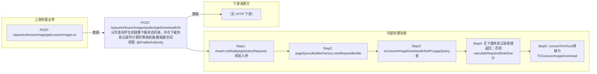

# POST /spacetci/lessonImage/student/getDownloadInfo

> 分页查询学生机镜像下载状态列表，存在下载失败记录时计算所需系统盘/数据盘空间 ｜ @EnableAuthority ｜ sync

## 依赖关系全景图

## 接口基本信息

| 项目 | 内容 |
|---|---|
| URL | /spacetci/lessonImage/student/getDownloadInfo |
| Controller | TCILessonImageDownloadController |
| 方法名 | getStudentLessonImageDownloadInfo |
| 权限注解 | @EnableAuthority |
| 执行方式 | sync |
| 业务含义 | 分页查询学生机镜像下载状态列表，存在下载失败记录时计算所需系统盘/数据盘空间 |

## 入参详情

### PageQueryRequest（要求stuName非空）

| 参数名 | 类型 | 必填 | 约束 | 说明 |
|---|---|---|---|---|
| rows | Integer | 否 | 分页行数 | 每页条数 |
| page | Integer | 否 | 分页页码 | 当前页 |
| stuName | String | 是 | 查询条件，非空 | 学生姓名，用于过滤下载状态记录 |
| condition | Object | 否 |  | 排序与过滤（condition） |
| sort | Object | 否 |  | 排序与过滤（sort） |## 出参详情

| 返回类型 | DefaultWebResponse<PageQueryResponse<TCILessonImageDownloadInfoVO>> |
|---|---|

| 字段 | 类型 | 说明 |
|---|---|---|
| itemArr[] | TCILessonImageDownloadInfoVO[] | 下载状态列表 |
| id | UUID | 记录ID |
| classroomId | UUID | 教室ID |
| lessonImageId | UUID | 课程镜像ID |
| imageId | UUID | 镜像模板ID |
| downloadStateEnum | ImageDownloadStateEnum | 下载状态 |
| terminalIp | String | 终端IP |
| terminalMac | String | 终端MAC |
| stuName | String | 学生姓名 |
| needSystemDiskSize | Integer | 下载所需系统盘大小(GB，有失败记录时返回) |
| needDataDiskSize | Integer | 下载所需数据盘大小(GB，有失败记录时返回) |
| downloadErrorEnum | DownloadErrorEnum | 下载失败原因枚举 |
| total | Long | 总条数 |

## 上游前置业务

### 前置1：POST /spacetci/lessonImage/getLessonImageList

课程镜像ID筛选（可空）（由 field_map 契约映射）
## 内部处理流程

### 处理流程

1. Assert.notNull(pageQueryRequest) 校验入参
2. pageQueryBuilderFactory.newRequestBuilder，追加notNull(stuName)过滤
3. tciLessonImageDownloadInfoAPI.pageQuery查询下载状态列表
4. 无下载失败记录直接返回；否则calculateRequiredDiskSize计算镜像分区大小+业务预留空间（个性桌面加策略盘大小，还原桌面按预留策略/最大分区差值计算）
5. convertToVOList转换为TCILessonImageDownloadInfoVO并附加needSystemDiskSize/needDataDiskSize返回

## 下游消费方

### 消费1：POST /spacetci/lessonImage/student/getDownloadInfo

学生机镜像下载状态，可作镜像推送异步完成判定（由 field_map 契约映射）
## 接口参数约束分析

| 层级 | 参数 | 规则 | 失败结果 |
|---|---|---|---|
| request | stuName | 查询必须携带stuName | pagekit notNull过滤无数据返回 |
| data | 镜像/策略 | 磁盘计算异常仅记日志不阻断 | calculateRequiredDiskSize catch后返回0值 |

## 参数取值策略

| 参数 | 策略 | 说明 |
|---|---|---|
| rows | user_input/from_query | 按业务构造 |
| page | user_input/from_query | 按业务构造 |
| stuName | user_input/from_query | 按业务构造 |
| sort/condition | user_input/from_query | 按业务构造 |

## 成功/失败断言基准

### 成功场景

| 场景 | 断言点 |
|---|---|
| 无下载失败记录 | $.status==SUCCESS && $.content.itemArr 非空（原始分页 DTO） |
| 存在下载失败记录 | $.status==SUCCESS && $.content.itemArr 非空 && 元素含 needSystemDiskSize/needDataDiskSize |

### 失败场景

| 场景 | 触发条件 | 断言点 |
|---|---|---|
| 分页参数为空 | pageQueryRequest为null | $.status==ERROR（Assert 参数校验，无固定 msgKey） |

## 环境清理机制

| 接口 | 说明 |
|---|---|
| 本接口创建的资源 | 通过对应 delete 接口清理 |

## 前置状态和幂等性标注

| 维度 | 结论 |
|---|---|
| 幂等性 | readonly |
| 说明 | 纯查询接口 |
