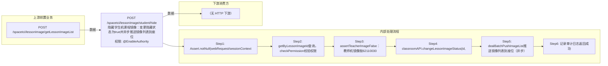

# POST /spacetci/lessonImage/student/hide

> 隐藏学生机课程镜像：变更隐藏状态为true并异步推送镜像列表到座位 ｜ @EnableAuthority ｜ sync

## 依赖关系全景图

## 接口基本信息

| 项目 | 内容 |
|---|---|
| URL | /spacetci/lessonImage/student/hide |
| Controller | TCILessonImageController |
| 方法名 | hideStudentLessonImage |
| 权限注解 | @EnableAuthority |
| 执行方式 | sync |
| 业务含义 | 隐藏学生机课程镜像：变更隐藏状态为true并异步推送镜像列表到座位 |

## 入参详情

### IdWebRequest

| 参数名 | 类型 | 必填 | 约束 | 说明 |
|---|---|---|---|---|
| id | UUID | 是 | @NotNull，课程镜像ID | 要隐藏的课程镜像ID |

## 出参详情

| 返回类型 | DefaultWebResponse |
|---|---|

| 字段 | 类型 | 说明 |
|---|---|---|
| msgKey | String | spacetci_lessonimage_hide_student_image_success_log |

## 上游前置业务

### 前置1：POST /spacetci/lessonImage/getLessonImageList

学生课程镜像ID（IdWebRequest=lessonImageId），来源为课程镜像列表（由 field_map 契约映射）
## 内部处理流程

### 批量处理器：PushImageListBatchTaskHandler(AbstractBatchTaskHandler)

| 步骤 | 说明 |
|---|---|
| 1 | processItem：seatAPI.pushClassroomImageList2Seat(seatId)逐座位推送镜像列表 |
| 2 | onFinish：seatAPI.refreshDeskInfo(classroomId)刷新桌面 |

### 处理流程

1. Assert.notNull(webRequest/sessionContext/builder) 校验入参
2. getByLessonImageId查询，checkPermission校验权限
3. assertTeacherImageFalse：教师机镜像抛62110030
4. classroomAPI.changeLessonImageStatus(id,true) 隐藏镜像
5. dealBatchPushImageList推送镜像列表到座位（异步）
6. 记录审计日志返回成功

## 下游消费方

### 消费1：POST /spacetci/lessonImage/student/hide

隐藏后镜像 hide 状态置为 true（由 field_map 契约映射）

> 📖 错误码/状态码对照表见 **code_map_all.md**（工程级全量）与 **error_code_map_tci_strategy.md**（TCI 接口级，含触发条件）。

## 接口参数约束分析

| 层级 | 参数 | 规则 | 失败结果 |
|---|---|---|---|
| data | admin | 需拥有镜像数据权限 | spacetci_lessonimage_permission_denied |
| business | id | 必须为学生机镜像 | 62110030 |

## 参数取值策略

| 参数 | 策略 | 说明 |
|---|---|---|
| id | user_input/from_query | 按业务构造 |

## 成功/失败断言基准

### 成功场景

| 场景 | 断言点 |
|---|---|
| 隐藏学生机镜像 | $.status==SUCCESS（content 为空，msgKey==spacetci_lessonimage_hide_student_image_success_log） |

### 失败场景

| 场景 | 触发条件 | 断言点 |
|---|---|---|
| 操作教师机镜像 | assertTeacherImageFalse抛异常 | $.status==ERROR && $.msgKey==spacetci_lessonimage_hide_student_image_fail_log |

## 环境清理机制

| 接口 | 说明 |
|---|---|
| POST /spacetci/lessonImage/student/show | 误隐藏时通过 show 接口恢复（反向操作） |

## 前置状态和幂等性标注

| 维度 | 结论 |
|---|---|
| 幂等性 | medium |
| 说明 | 重复隐藏幂等（状态置true），但每次都会触发推送批处理 |
