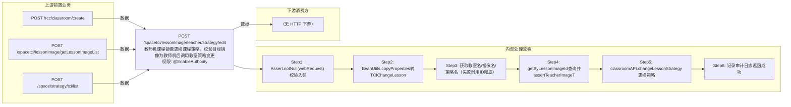

# POST /spacetci/lessonImage/teacher/strategy/edit

> 教师机课程镜像更换课程策略，校验目标镜像为教师机后调用教室策略变更 ｜ @EnableAuthority ｜ sync

## 依赖关系全景图

## 接口基本信息

| 项目 | 内容 |
|---|---|
| URL | /spacetci/lessonImage/teacher/strategy/edit |
| Controller | TCILessonImageController |
| 方法名 | editTeacherStrategy |
| 权限注解 | @EnableAuthority |
| 执行方式 | sync |
| 业务含义 | 教师机课程镜像更换课程策略，校验目标镜像为教师机后调用教室策略变更 |

## 入参详情

### TCIChangeLessonStrategyWebRequest

| 参数名 | 类型 | 必填 | 约束 | 说明 |
|---|---|---|---|---|
| classroomId | UUID | 是 | @NotNull，教室ID | 教室 |
| lessonImageId | UUID | 是 | @NotNull，课程镜像ID | 要更换策略的教师机课程镜像 |
| lessonStrategyId | UUID | 是 | @NotNull，课程策略ID | 新的课程策略 |

## 出参详情

| 返回类型 | DefaultWebResponse |
|---|---|

| 字段 | 类型 | 说明 |
|---|---|---|
| msgKey | String | spacetci_lessonimage_change_teacher_image_lessonstrategy_success_log |

## 上游前置业务

### 前置1：POST /rcc/classroom/create

教室ID，来源为教室创建返回（由 field_map 契约映射）

### 前置2：POST /spacetci/lessonImage/getLessonImageList

教师课程镜像ID，来源为课程镜像列表（由 field_map 契约映射）

### 前置3：POST /space/strategy/tci/list

TCI课程策略ID，来源为策略列表（由 field_map 契约映射）
## 内部处理流程

### 处理流程

1. Assert.notNull(webRequest) 校验入参
2. BeanUtils.copyProperties转TCIChangeLessonStrategyDTO
3. 获取教室名/镜像名/策略名（失败时用ID兜底）
4. getByLessonImageId查询并assertTeacherImageTrue：学生机镜像抛62110029
5. classroomAPI.changeLessonStrategy 更换策略
6. 记录审计日志返回成功

## 下游消费方

### 消费1：POST /spacetci/lessonImage/teacher/strategy/edit

镜像更换后的策略ID（由 field_map 契约映射）

> 📖 错误码/状态码对照表见 **code_map_all.md**（工程级全量）与 **error_code_map_tci_strategy.md**（TCI 接口级，含触发条件）。

## 接口参数约束分析

| 层级 | 参数 | 规则 | 失败结果 |
|---|---|---|---|
| business | lessonImageId | 必须为教师机镜像 | 62110029 SPACETCI_LESSONIMAGE_CANNOT_FIND_TEACHER_IMAGE |
| business | lessonStrategyId | 策略磁盘需与镜像匹配 | 62110024/62110025/62110026 |

## 参数取值策略

| 参数 | 策略 | 说明 |
|---|---|---|
| classroomId | user_input/from_query | 按业务构造 |
| lessonImageId | user_input/from_query | 按业务构造 |
| lessonStrategyId | user_input/from_query | 按业务构造 |

## 成功/失败断言基准

### 成功场景

| 场景 | 断言点 |
|---|---|
| 更换教师机镜像策略 | $.status==SUCCESS（content 为空，msgKey==spacetci_lessonimage_change_teacher_image_lessonstrategy_success_log） |

### 失败场景

| 场景 | 触发条件 | 断言点 |
|---|---|---|
| 目标是学生机镜像 | assertTeacherImageTrue抛62110029 | $.status==ERROR && $.msgKey==spacetci_lessonimage_change_teacher_image_lessonstrategy_fail_log |

## 环境清理机制

| 接口 | 说明 |
|---|---|
| POST /spacetci/lessonImage/teacher/strategy/edit | 误操作时再次调用本接口换回原策略 |

## 前置状态和幂等性标注

| 维度 | 结论 |
|---|---|
| 幂等性 | medium |
| 说明 | 重复设置相同策略可视为幂等；不同策略为覆盖写 |
